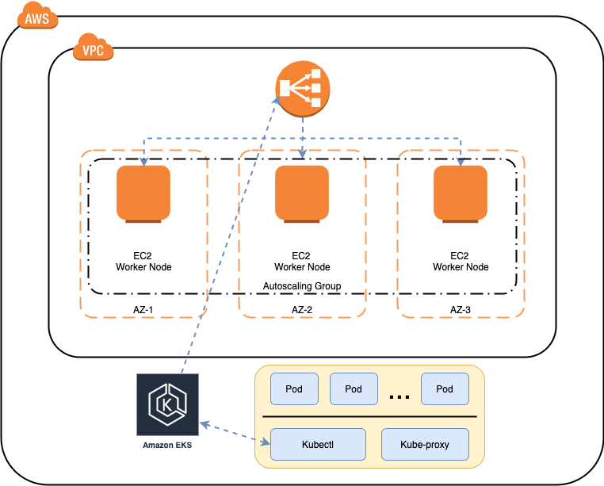

# EKS Terraform

Project to deploy a standar EKS cluster

## Prerequisites

- Terraform 
- Kubectl
- aws-iam-authenticator

## TODO

- [x] Terraform with standar configuration to EKS 
- [x] Script to automatically set kubeconfig on deploy machine
- [ ] Add istio as part of deploy
- [ ] Add settiable yaml project as part of deploy 
- [ ] Add helm to control yaml project deploy
- [ ] Istall logging tools
- [ ] Istall monitoring tools
- [ ] Add basic CD/CI pipeline over AWS

  

